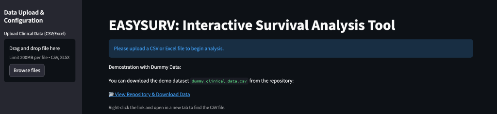

# EASYSURV: Interactive Survival Analysis Tool

[](https://easysurv.streamlit.app/)

A web-based tool for performing comprehensive survival analysis (Kaplan-Meier, Cox Proportional Hazards) on clinical datasets without writing code.



## Features

### 📊 Interactive Kaplan-Meier Plots
*   **Customizable Groups**: Compare survival between groups (e.g., Treatment vs Control, Mutation Status).
*   **Publication-Ready**: 
    *   Clean designs with "Journal" (Nature, Cell, Blood) and Fun themes.
    *   Aligning Risk Tables.
    *   Censoring marks and 95% Confidence Intervals.
    *   **Download plots at 300 & 600 DPI**.

### 📉 Statistical Analysis
*   **Univariable Analysis**: Log-rank tests and Median Survival (Time-to-Event).
*   **Multivariable Cox Regression**:
    *   Adjust for multiple covariates (Age, Sex, etc.).
    *   Results table with Hazard Ratios (HR), 95% CI, and p-values.
    *   **Forest Plots** for visualizing regression results.
*   **Competing Risks Analysis (New!)**:
    *   **Aalen-Johansen Estimator**: Accurate CIF plots (Cumulative Incidence Function).
    *   **Fine-Gray Regression**: Subdistribution Hazard Ratios for competing events.
    *   **Gray's Test**: Compare cumulative incidence between groups.
    *   **Gray's Test**: Compare cumulative incidence between groups.
    *   **Point-in-Time Tables**: CIF estimates at 12, 18, 24 months.

### 🧬 Biomarker Discovery & Optimization
*   **Variable Generation**: 
    *   Combine categorical variables (e.g., `LSC` + `NGS` -> 4 groups).
    *   Create custom boolean logic groups (e.g., Age > 60 AND High Risk).
*   **Cutoff Finder**: Automatically find the optimal cutoff for continuous variables using Log-Rank maximization.
*   **Time-Dependent ROC**: Calculate AUC and optimal cutoffs for predicting events at specific time points.
*   **Data Export**: Download the enhanced dataset with all new custom variables included.
### 🛠️ Easy to Use
*   **No Code Required**: Just upload your CSV or Excel file.
*   **Secure**: Data is processed in memory; no data is stored permanently if running locally or on ephemeral cloud instances.

---

## 🚀 How to Run

### Option 1: Web (Streamlit Cloud)
Access the tool directly via the web link (if deployed):
> **[Use the App Here](https://easysurv.streamlit.app/)**

### Option 2: Run Locally (Python)
If you prefer to run it on your own machine:

1.  **Clone the repository**:
    ```bash
    git clone https://github.com/gauravchatnobel/Easysurv.git
    cd Easysurv
    ```

2.  **Install Requirements**:
    ```bash
    pip install -r requirements.txt
    ```

3.  **Run the App**:
    ```bash
    streamlit run app.py
    ```

---

## 📂 Demo Data
A dummy dataset `dummy_clinical_data.csv` is included in this repository. You can use it to test the app features.

| ID | OS_Days | OS_Status | MRD_Status | ... |
|----|---------|-----------|------------|-----|
| P1 | 100     | 1         | Pos        | ... |
| P2 | 450     | 0         | Neg        | ... |

---

## 📄 License
[MIT](LICENSE)
